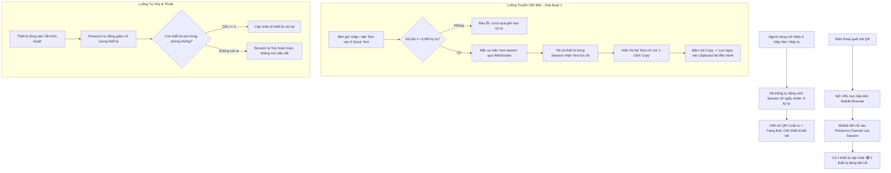

# 1. Tổng quan & Core Logic (Định vị & Vỏ bọc Sản phẩm)

### 1.1 Định vị Sản phẩm (Product Facade)
- **Tên ứng dụng**: `QuickText` (hoặc `QuickCopy`).
- **Định vị bề ngoài (Facade)**: Tiện ích truyền văn bản tức thì giữa các thiết bị không cần tài khoản, không cần cài app, phục vụ copy mã OTP, token, link, đoạn code, ghi chú ngắn từ điện thoại sang máy tính (máy net/máy lạ) và ngược lại.
- **Ẩn ý thiết kế (Hidden Multi-user)**: Bản chất hệ thống là một mesh stream thời gian thực (Zero-persistence Realtime Room). UI/UX không dùng các từ ngữ "phòng chat", "tin nhắn", "chat bot" mà dùng:
  - *"Tạo phiên chia sẻ" (Start Transfer Session / New Bridge)*
  - *"Thiết bị đã kết nối" (Connected Devices / Paired)*
  - *"Clipboard từ xa" (Remote Clipboard Stream)*
  - *"Sao chép 1 chạm" (Instant 1-Click Copy)*
- Người dùng sử dụng ban đầu như một công cụ copy tiện lợi, sau đó tự khám phá ra khả năng kết nối nhiều máy cùng lúc thành một mạng chia sẻ ẩn danh tức thì.

### 1.2 Nguyên tắc Bất biến (Core Invariants)
1. **Zero Database / Zero Persistence**: Không lưu trữ bất kỳ ký tự nào vào cơ sở dữ liệu hoặc ổ đĩa. Toàn bộ text chỉ truyền qua RAM của kênh realtime và biến mất khi ra khỏi bộ nhớ client.
2. **Zero History on Join**: Người hoặc thiết bị vào sau sẽ chỉ nhận các nội dung được gửi **kể từ thời điểm họ kết nối**. Màn hình ban đầu là trắng tinh / trạng thái chờ, không hiển thị lịch sử cũ.
3. **Multi-device Session**: Hỗ trợ không giới hạn số lượng thiết bị quét cùng một mã QR để tham gia phiên truyền tải.
4. **Auto-Destroy on Disconnect**: Khi thiết bị cuối cùng đóng tab, phiên chia sẻ (Session/Room) tự động giải phóng hoàn toàn khỏi mạng lưới.

---

# 2. Luồng xử lý (Flowchart)

---

# 3. Thiết kế Giao diện (UI/UX Facade)

### 3.1 Giao diện Máy Chủ Trì (Máy Net / Desktop)
- **Khu vực Trọng tâm**: 
  - Mã QR to, sắc nét, tương phản cao để camera điện thoại nhận diện trong 0.2 giây.
  - Link chia sẻ rút gọn kèm nút copy link.
  - Badge trạng thái: `🟢 Đang kết nối: X thiết bị`.
- **Khu vực Bảng Nhận (Incoming Stream)**:
  - Mỗi đoạn text gửi đến hiển thị dạng thẻ tối giản (Card).
  - Nút **"SAO CHÉP" (COPY)** to, nổi bật, khi click đổi sang tick xanh `Đã chép!`.
- **Khu vực Gửi Nhanh**:
  - Khung nhập văn bản đa dòng (hỗ trợ phím tắt `Ctrl + Enter` hoặc nút `Gửi tới các máy`).
  - Bộ đếm ký tự: `[ 0 / 5000 ]`.

### 3.2 Giao diện Thiết bị Di động (Mobile Web)
- Tối ưu 100% cho màn hình dọc.
- Tự động ẩn mã QR (hoặc thu nhỏ vào nút xem QR) để nhường toàn bộ không gian cho khung nhập liệu và danh sách text đã nhận.
- Hỗ trợ nút `Dán & Gửi ngay` (Paste & Send) 1 chạm từ clipboard điện thoại.

---

# 4. Edge Cases & Kịch bản Biên (Edge Cases)

1. **Edge Case 1: Spam ký tự hoặc Payload lớn bất thường**
   - *Rủi ro*: Người dùng cố tình paste file dung lượng lớn hoặc văn bản > 10,000 ký tự làm sập kết nối WebSocket.
   - *Xử lý*: Chặn cứng ở Frontend: Giới hạn `maxLength = 5000`. Khi vượt quá, tự động cắt ngắn và cảnh báo người dùng.
2. **Edge Case 2: Mạng chập chờn / Điện thoại tắt màn hình (Sleep Mode)**
   - *Rủi ro*: Khi điện thoại tắt màn hình, trình duyệt mobile ngắt kết nối WebSocket tạm thời. Khi mở khóa lại, người dùng tưởng vẫn còn trong phòng nhưng thực tế đã rớt socket.
   - *Xử lý*: Bắt sự kiện `visibilitychange` hoặc `online/offline`. Nếu phát hiện vừa active lại sau khi sleep, tự động trigger re-join/re-subscribe vào Session ID hiện tại.
3. **Edge Case 3: Người thứ 3 đoán mò hoặc nhập bừa Session ID**
   - *Rủi ro*: Session ID quá ngắn có thể bị brute-force để vào xem trộm text.
   - *Xử lý*: Session ID sinh dạng NanoID cryptographically secure (kết hợp chữ hoa, chữ thường và số, entropy cao) hoặc bổ sung Secret Key mã hóa nằm ở URL Hash (`/s/A1B2C3#KeyXYZ`).
4. **Edge Case 4: Không lưu vết trên máy net (Privacy at Cyber Cafe)**
   - *Rủi ro*: Trình duyệt máy net lưu cache form hoặc local storage chứa OTP của người dùng sau khi họ rời đi.
   - *Xử lý*: Tuyệt đối **KHÔNG lưu text vào `localStorage` hay `sessionStorage`**. Toàn bộ dữ liệu chỉ nằm trong React/JS State (RAM). Khi tắt tab hoặc F5, toàn bộ dữ liệu biến mất không để lại bất kỳ file tạm nào.
